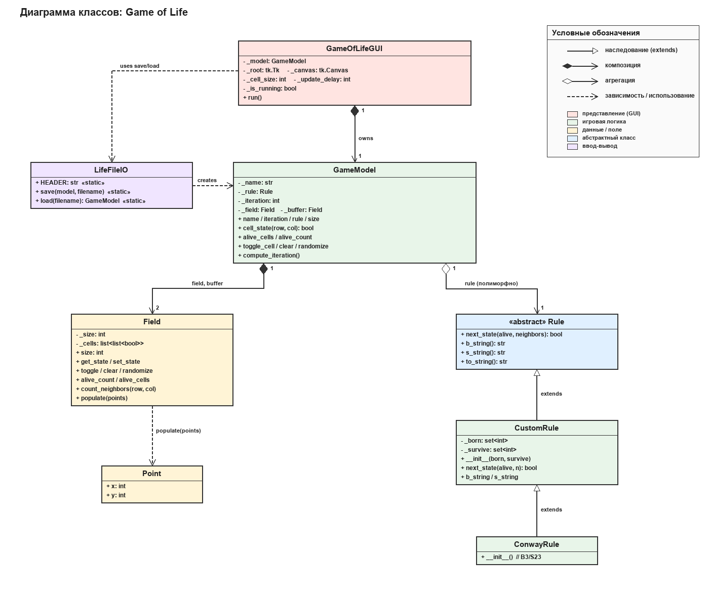

# Game of Life

Учебная реализация клеточного автомата Джона Конвея на Python с графическим интерфейсом на Tkinter.



## Запуск

Требуется Python 3.10+ со штатным Tkinter.

```bash
python main.py
```

## Возможности

- Поле 20×20 с тороидальными границами.
- Расстановка клеток мышью (клик и перетаскивание).
- Старт / Стоп / Шаг с регулировкой скорости (50–1000 мс/кадр).
- Случайное заполнение и очистка.
- Сохранение и загрузка в формате [Life 1.06](https://conwaylife.com/wiki/Life_1.06).
- Загруженное правило (например, `B36/S23` — HighLife) применяется автоматически.
- Адаптивный размер клеток при изменении окна; F11 — полный экран.

### Горячие клавиши

| Клавиша | Действие |
|---|---|
| Пробел | Старт / Стоп |
| → | Один шаг |
| C | Очистить поле |
| R | Случайное заполнение |
| S | Сохранить в файл |
| L | Загрузить из файла |
| F11 | Полноэкранный режим |

## Архитектура

```
main.py             точка входа
point.py            Point — координата клетки
rule.py             Rule (ABC) → CustomRule → ConwayRule
field.py            Field — хранение клеток, тороидальные границы
game_model.py       GameModel — фасад над Field и Rule
life_file.py        LifeFileIO — формат Life 1.06
gui.py              GameOfLifeGUI — Tkinter-интерфейс
examples/           готовые паттерны
docs/               отчёты по проекту
```

## Документы

| Документ | Файл |
|---|---|
| Техническое задание | [docs/ТЗ.docx](docs/ТЗ.docx) |
| Диаграмма классов | [docs/Диаграмма_классов.docx](docs/Диаграмма_классов.docx) |
| Сценарий тестирования | [docs/Тест-сценарий.docx](docs/Тест-сценарий.docx) |
| Презентация | [docs/Презентация.pptx](docs/Презентация.pptx) |

## Команда

| Роль | Ответственность |
|---|---|
| Менеджер | ТЗ, координация, репозиторий |
| Разработчик | Код, диаграмма классов |
| Тестировщик | Сценарий тестирования, отчёт, презентация |

## Лицензия

Учебный проект.
